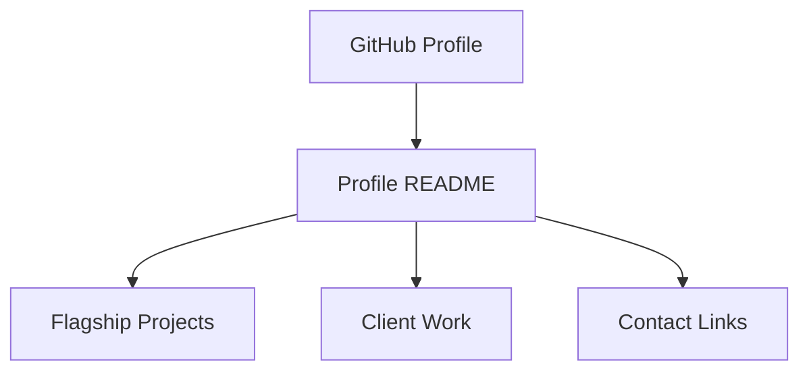

# Blueprint: savvops/savvops

_Auto-generated architectural documentation — 2026-09-24 (Phase 1). Built from the repository file tree, README and manifests._

## Diagram

## How it works

This is Nelson's GitHub profile repository — the special repo whose `README.md` renders on his public GitHub profile page. It contains exactly one file: the profile README itself.

The README is a professional pitch: "Using AI as an operating system" — AI Automation & Web Systems Developer and Digital Solutions Architect in Winnipeg, open to remote roles. It showcases flagship projects in a table (Nerdbot, HtmlToMp4 Pro, HTMLHub, SavvOps Automation) with their stacks, summarizes web design and client work, and links out to Savv Studio and contact channels. No code, no build — the whole repo is a personal landing page inside GitHub.

## Key files

- `README.md` — the entire repo: profile pitch, project table, contact links

## For the owner

Your GitHub business card. Anyone who lands on your profile sees this first, so it reads as a hiring-manager pitch: what you build, the stacks you ship, and where to reach you. Keep the flagship table current — it is the highest-leverage single file in your GitHub presence.
